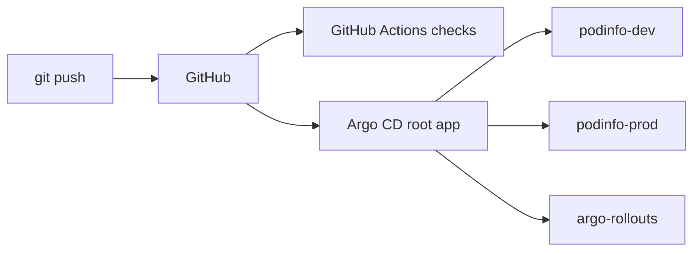

# gitops-platform

I wanted to learn how teams actually deploy to Kubernetes, so I built a small GitOps setup on a local kind cluster with Argo CD.

The rule I followed: nothing gets deployed with kubectl or helm by hand, except Argo CD itself and one root app. Everything else comes from this repo.

## How it works



- `bootstrap/` - Argo CD install script and the root app. These are the only two things I apply manually.
- `apps/` - the Argo CD Applications. The root app watches this folder, so adding a new app is just adding a file here.
- `charts/podinfo/` - Helm chart I wrote myself for podinfo (a small demo app that shows its version on the page).
- `environments/` - dev and prod values. Dev runs 1 replica with a green page, prod runs 3 replicas with a blue page.
- `policy/` - Rego rules that CI checks.
- `.github/workflows/ci.yml` - helm lint, kubeconform and conftest for dev and prod.

## Things I tested

**Self-heal.** I scaled the prod deployment to 5 replicas with kubectl. Argo CD put it back to what Git says within seconds.

**Canary release.** Prod uses an Argo Rollout instead of a Deployment. Going from 6.14.1 to 6.15.0, it stopped at 33% and waited for me to run `kubectl argo rollouts promote`, then went to 66% and then 100%.

**Bad release.** I pushed an image tag that doesn't exist (6.99.0). The new pod was stuck in ImagePullBackOff and never got ready, so it got no traffic at all. I checked this by curling the service from a pod inside the cluster, every response was 6.15.0. Then I aborted the rollout and did a `git revert`. The abort alone wasn't enough because Git still had the bad tag.

One thing that confused me at first: you can't see a canary split through `kubectl port-forward`, because it sticks to one pod. That's why I tested from inside the cluster.

## Why some things are the way they are

- Chart versions are pinned (Argo CD 10.10.0, Argo Rollouts 2.43.6) so a rebuild gives the same result.
- Deployment and Rollout share one pod template in `_helpers.tpl`. Before and after that change I diffed the rendered output to make sure nothing changed.
- `runAsUser: 100` came from running `id` inside the image. The image user is a name ("app"), and `runAsNonRoot` can't verify a name, it needs a number.
- Canary steps are 33 and 66 because prod has 3 pods. Without a service mesh, Rollouts splits traffic by pod count, so 20% would still mean 1 pod.
- The root app and argo-rollouts app don't have a finalizer. If someone deletes them by mistake, I don't want it to take prod down with it.
- Only a memory limit, no CPU limit, to avoid CPU throttling.
- No branch protection because I'm the only one working on this repo. In a team I'd turn it on.

## Problems I ran into

**Control plane kept crashing.** Right after creating the cluster, kube-controller-manager and kube-scheduler were in CrashLoopBackOff with `leaderelection lost`. I first thought it was inotify limits, then memory. Both were wrong. The etcd logs showed reads taking 1 to 3 seconds, and `docker stats` showed my old kind cluster from the first project had done hundreds of GB of disk reads. Deleting that cluster fixed it. Now I only run one cluster at a time.

**A bug that didn't break anything.** At one point my deployment template had the whole Deployment written twice in the same file. Everything still worked because YAML just took the second copy, so I didn't notice until much later. `kubeconform -strict` in CI catches this now.

## Run it

You need Docker, kind, kubectl and helm.

```bash
kind create cluster --name gitops
./bootstrap/argocd/install.sh
kubectl apply -f bootstrap/root-app.yaml
```

Argo CD UI:

```bash
kubectl -n argocd get secret argocd-initial-admin-secret -o jsonpath="{.data.password}" | base64 -d; echo
kubectl port-forward svc/argocd-server -n argocd 8080:80
```

podinfo dev and prod:

```bash
kubectl port-forward -n podinfo-dev svc/podinfo 9898:9898
kubectl port-forward -n podinfo-prod svc/podinfo 9899:9898
```

## What I want to add next

- Automatic canary analysis with Prometheus instead of me promoting by hand
- Proper promotion flow, dev first and then prod through a pull request
- Argo CD Image Updater
